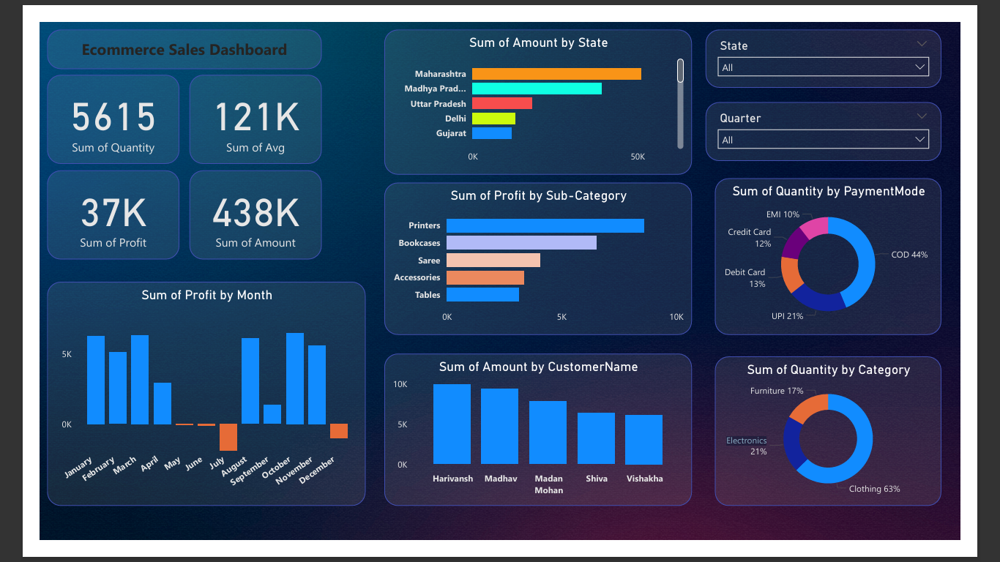

- Ecommerce Sales Dashboard (ABC Store)

- Objective:
  -Owner of ABC Store wants us to help them create a dashboard to track and analyze their online sales across India.

- Description:
  - This Power BI dashboard provides deep insights into the online sales performance of ABC Store. It covers product category trends, customer behavior, and region-wise revenue distribution.

- Project Learnings:
  - Created an interactive dashboard to track and analyze online sales data.
  - Used complex parameters for drill-down analysis and enabled filtering via slicers. 
  - Established relationships between tables, performed joins, and built calculated measures for deeper insights.
- Utilized a variety of custom visualizations:
  - Bar Chart, Pie Chart, Donut Chart, Clustered Bar, Scatter Plot, Line, Area Chart, Maps, Slicers, etc.

- Tools Used:
 - Power BI
 - Excel

- Preview:
  

- Files Included:
 - Ecommerce_Sales_Dashboard.pbix
 - ABC Store.pngs
 - Details.csv
 - Orders.csv
